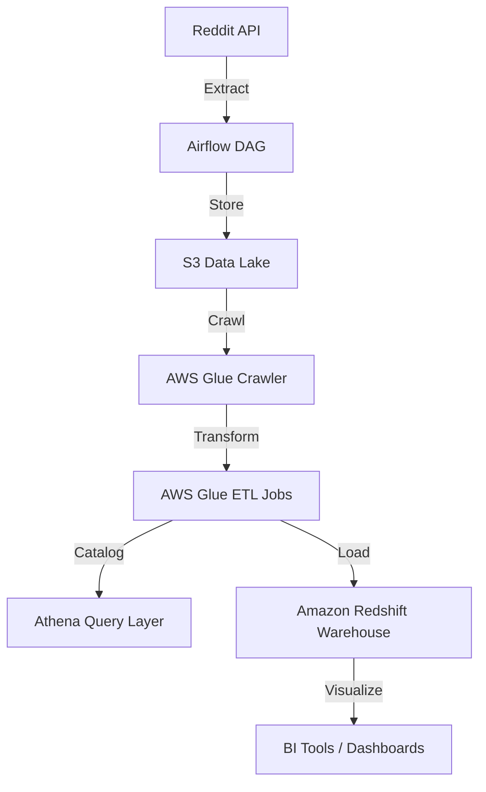

---

# 🚀 Reddit Data Engineering Pipeline

*End-to-End Modern Data Pipeline using Airflow, Celery, PostgreSQL, S3, AWS Glue, Athena, and Redshift*

---

## 📖 Overview

This project showcases a **production-grade data engineering pipeline** that ingests real Reddit data and processes it through a modern, scalable AWS-based data stack.

The pipeline demonstrates:

* Automated **data extraction** from Reddit’s API
* **Workflow orchestration** using Apache Airflow and Celery
* **Raw and processed data storage** in Amazon S3
* **ETL transformations** using AWS Glue
* **Serverless querying** via Amazon Athena
* **Data warehousing** and analytics in Amazon Redshift

💡 *This project embodies core data engineering principles: modularity, scalability, automation, and cloud-native design.*

---

## 🏗️ Architecture



**Workflow Summary:**

1. **Extract:** Airflow DAG pulls posts/comments from Reddit using API credentials.
2. **Store:** Raw JSON data lands in Amazon S3 for durability and versioning.
3. **Transform:** AWS Glue cleans and structures data for analytics.
4. **Query:** Athena provides quick ad-hoc analysis directly on S3.
5. **Load:** Final curated data is pushed into Amazon Redshift for BI and reporting.

---

## 🧰 Tech Stack

| Category                | Tools / Services                              |
| ----------------------- | --------------------------------------------- |
| **Programming**         | Python, SQL                                   |
| **Orchestration**       | Apache Airflow, Celery                        |
| **Database / Metadata** | PostgreSQL                                    |
| **Data Lake**           | Amazon S3                                     |
| **ETL / Catalog**       | AWS Glue                                      |
| **Query Layer**         | Amazon Athena                                 |
| **Warehouse**           | Amazon Redshift                               |
| **Infrastructure**      | AWS IAM, boto3, Docker (optional for Airflow) |

---

## ⚙️ Getting Started

### 🪜 Prerequisites

* AWS account with permissions for S3, Glue, Athena, and Redshift
* Reddit API credentials (`client_id`, `secret`, `user_agent`)
* Python 3.9+
* Airflow installed and configured (Celery executor optional)
* PostgreSQL (for Airflow metadata database or local setup)

---

### 🔧 Setup Instructions

#### 1️⃣ Clone the repository

```bash
git clone https://github.com/yourusername/reddit-data-engineering-pipeline.git
cd reddit-data-engineering-pipeline
```

#### 2️⃣ Configure environment variables

Create a `.env` file:

```bash
REDDIT_CLIENT_ID=<your_client_id>
REDDIT_SECRET=<your_secret>
REDDIT_USER_AGENT=<your_app_name>
AWS_ACCESS_KEY_ID=<your_access_key>
AWS_SECRET_ACCESS_KEY=<your_secret_key>
AWS_REGION=us-east-1
S3_BUCKET_NAME=reddit-data-pipeline
```

#### 3️⃣ Set up Airflow

Initialize Airflow:

```bash
airflow db init
airflow users create -u admin -p admin -r Admin -e admin@example.com -f Admin -l User
airflow webserver &
airflow scheduler &
```

#### 4️⃣ Configure AWS Services

* Create your S3 bucket.
* Set up AWS Glue crawler and ETL job (or use provided scripts).
* Ensure Athena and Redshift are connected via Glue Data Catalog.

---

## 📁 Project Structure

```
reddit-data-pipeline/
├── dags/
│   └── reddit_dag.py               # Airflow DAG definition
├── etl/
│   ├── extract_reddit.py           # Extract data from Reddit API
│   ├── transform_glue_job.py       # AWS Glue ETL transformation
│   └── load_to_redshift.py         # Load curated data to Redshift
├── config/
│   ├── aws_config.yaml             # AWS paths & table configs
│   └── reddit_config.yaml          # Subreddits, filters, etc.
├── scripts/
│   └── setup_infrastructure.py     # Optional: script to create AWS resources
├── .env                            # Environment variables
├── requirements.txt                # Dependencies
└── README.md                       # Project documentation
```

---

## 📊 Data Flow Summary

| Stage              | Tool                 | Description                                    |
| ------------------ | -------------------- | ---------------------------------------------- |
| **Ingestion**      | Airflow + Reddit API | Collect posts/comments by keyword or subreddit |
| **Landing**        | S3                   | Store raw JSON data                            |
| **Transformation** | AWS Glue             | Clean, enrich, and flatten nested data         |
| **Query**          | Athena               | On-demand SQL queries                          |
| **Warehouse**      | Redshift             | Build analytical tables                        |
| **Visualization**  | QuickSight / Tableau | Explore Reddit trends and KPIs                 |

---

## ✅ Key Features

* 🔄 **Fully automated ETL** orchestrated via Airflow
* ☁️ **Scalable cloud architecture** using S3, Glue, and Redshift
* 🧩 **Modular and reusable** components (extract, transform, load separated)
* 💰 **Cost-efficient** via serverless Athena queries on S3
* 📈 **Production-ready design** with monitoring, retries, and logging

---

## 🧠 Future Enhancements

* Add **real-time ingestion** via Kafka or Kinesis
* Integrate **data quality checks** with Great Expectations
* Add **data lineage & metadata** via AWS Glue Catalog APIs
* Containerize Airflow setup with Docker Compose
* Build **ML-ready datasets** for sentiment analysis on Reddit comments

---

## 🛡️ Best Practices

* Use **parameterized Airflow DAGs** for flexibility
* Partition S3 data for faster Athena queries
* Implement **IAM least privilege** for security
* Use **COPY command** with manifest files for Redshift bulk loads
* Monitor pipeline with Airflow’s logs and alerts

---

## 🧾 License & Acknowledgement

* Inspired by [Yusuf Ganiyu’s Medium article](https://medium.com/towards-data-engineering/data-engineering-with-reddit-airflow-celery-postgres-s3-aws-glue-athena-redshift-96319d7a46bd).
* Created for educational and portfolio purposes.
* License: MIT (modify as needed).

---


